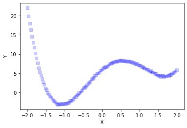
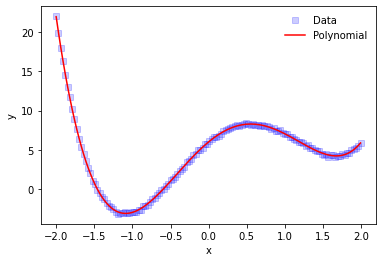
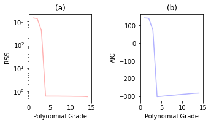
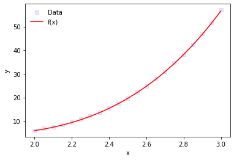

# Final Evaluation
## Problem 1.
### a) Finding the a polynomial to fit the data

Loading the packages and reading the data.


```python
from scipy import stats
import numpy as np
import pandas as pd 
import math
import matplotlib.pyplot as plt
from random import seed
import numpy.polynomial.polynomial as poly
#from numpy.polynomial import Polynomial
```


```python
data = pd.read_csv('problem1.csv')
data.head(-10)
```


<div>
<style scoped>
    .dataframe tbody tr th:only-of-type {
        vertical-align: middle;
    }

    .dataframe tbody tr th {
        vertical-align: top;
    }

    .dataframe thead th {
        text-align: right;
    }
</style>
<table border="1" class="dataframe">
  <thead>
    <tr style="text-align: right;">
      <th></th>
      <th>X_training</th>
      <th>Y_training</th>
      <th>X_test</th>
      <th>Y_test</th>
    </tr>
  </thead>
  <tbody>
    <tr>
      <th>0</th>
      <td>-2.00</td>
      <td>22.067387</td>
      <td>2.00</td>
      <td>6.024049</td>
    </tr>
    <tr>
      <th>1</th>
      <td>-1.97</td>
      <td>19.944915</td>
      <td>2.05</td>
      <td>6.885408</td>
    </tr>
    <tr>
      <th>2</th>
      <td>-1.94</td>
      <td>18.062490</td>
      <td>2.10</td>
      <td>7.578968</td>
    </tr>
    <tr>
      <th>3</th>
      <td>-1.91</td>
      <td>16.384313</td>
      <td>2.15</td>
      <td>8.439467</td>
    </tr>
    <tr>
      <th>4</th>
      <td>-1.88</td>
      <td>14.567798</td>
      <td>2.20</td>
      <td>9.554611</td>
    </tr>
    <tr>
      <th>...</th>
      <td>...</td>
      <td>...</td>
      <td>...</td>
      <td>...</td>
    </tr>
    <tr>
      <th>119</th>
      <td>1.57</td>
      <td>4.096029</td>
      <td>NaN</td>
      <td>NaN</td>
    </tr>
    <tr>
      <th>120</th>
      <td>1.60</td>
      <td>4.341366</td>
      <td>NaN</td>
      <td>NaN</td>
    </tr>
    <tr>
      <th>121</th>
      <td>1.63</td>
      <td>4.355296</td>
      <td>NaN</td>
      <td>NaN</td>
    </tr>
    <tr>
      <th>122</th>
      <td>1.66</td>
      <td>4.061534</td>
      <td>NaN</td>
      <td>NaN</td>
    </tr>
    <tr>
      <th>123</th>
      <td>1.69</td>
      <td>4.214335</td>
      <td>NaN</td>
      <td>NaN</td>
    </tr>
  </tbody>
</table>
<p>124 rows × 4 columns</p>
</div>


Setting and checking the data


```python
x_train = data.X_training
y_train = data.Y_training
```

Plotting raw data


```python
ax = plt.plot(x_train, y_train,'bs',alpha=0.2,)
plt.xlabel('X')
plt.ylabel('Y')
plt.savefig('fdx.pdf', format='pdf', dpi=1200, bbox_inches="tight")
plt.show()
```





### Polynomial Fitting

Using the Polynomial Module from Numpy in order to fit a polynomial to the data using the least square method.


```python
coef = poly.polyfit(x_train, y_train, 8,rcond=None,w=None) # Assuming a Polynomyal degree 8
```

#### Creating and plotting the resulting Polynomial Model 


```python
model = poly.Polynomial(coef)
model
```


$x \mapsto \text{6.007938949185451} + \text{8.037968100328243}\,x - \text{6.063208668293324}\,x^{2} - \text{3.0250349986092853}\,x^{3} + \text{2.0950040571004425}\,x^{4} + \text{0.008001051821497561}\,x^{5} - \text{0.04294316587790551}\,x^{6} - \text{0.0011211379393194442}\,x^{7} + \text{0.005735129230568854}\,x^{8}$


```python
plt.plot(x_train, y_train,'bs',alpha=0.2, label='Data')
plt.plot(x_train,model(x_train),'r', label='Polynomial')
plt.legend(loc='best', frameon=False)
plt.xlabel('x')
plt.ylabel('y')
plt.show()
```





### b) Finding the best polynomial to fit the data


```python
Pol_Max = 15 #We will check for polynomials with max degree 15
RSSv = [] 
RSSv = np.zeros(Pol_Max-1)
AICv = []
AICv = np.zeros(Pol_Max-1)
```

Checking different polynomials  and calculating the corresponding RSS and AIC.


```python
for i in np.arange(0,Pol_Max-1,1):
        coef = poly.polyfit(x_train, y_train, i+1)        
        model = poly.Polynomial(coef)
        RSSv[i]=0.5*np.sum((y_train-model(x_train))**2)
        AICv[i]=len(x_train)*math.log10(RSSv[i]/len(x_train))+ 2*len(coef)*len(x_train)/(len(x_train)-len(coef)-1)
```

#### Plotting the RSS and AIC.


```python
fig, (ax1, ax2) = plt.subplots(1, 2)
ax1.plot(np.arange(0,Pol_Max-1,1)+1, RSSv,'r',alpha=0.3)
ax1.set_yscale('log')
ax1.legend(loc='best', frameon=False)
ax1.set(xlabel='Polynomial Grade', ylabel='RSS')
ax1.set(xlim=(0, Pol_Max))
ax1.set_title('(a)')
# Second #figure
fig.tight_layout(pad=5.0)
ax2.plot(np.arange(0,Pol_Max-1,1)+1, AICv,'b',alpha=0.3)
ax2.set(xlabel='Polynomial Grade', ylabel='RSS')
ax2.legend(loc='best', frameon=False)
ax2.set(xlabel='Polynomial Grade', ylabel='AIC')
ax2.set(xlim=(0, Pol_Max))
ax2.set_title('(b)')
plt.savefig('AIC.pdf', format='pdf', dpi=1200, bbox_inches="tight")
plt.show()
```

    No handles with labels found to put in legend.
    No handles with labels found to put in legend.
    





With the graphs is clear that the degree with lowest RSS and AIC is 4. Remember that the lower AIC does not implies the best model, insted the corresponding polynomial model of degree 4 is better model that the others we checked.


```python
grade = np.argmin(AICv)+1
grade
```


    4


```python
poly.polyfit(x_train, y_train, grade)
```


    array([ 6.0000592 ,  8.02956741, -5.99141415, -3.00869471,  1.99588109])


Then, we choose the next polynomial.


```python
coef4 = poly.polyfit(x_train, y_train, 4,rcond=None,w=None)
model4 = poly.Polynomial(coef4)
model4
```


$x \mapsto \text{6.000059202668222} + \text{8.029567412979471}\,x - \text{5.991414146668385}\,x^{2} - \text{3.0086947131582304}\,x^{3} + \text{1.9958810906630036}\,x^{4}$


### c) Cross Validating the polynomial with the testing data

Loading the testing data and checking the predicton with the polinomyal of degree 4.


```python
x_test = data.X_test
y_test = data.Y_test
x_test = x_test[~np.isnan(x_test)]
y_test = y_test[~np.isnan(y_test)]
```


```python
plt.plot(x_test, y_test,'bs',alpha=0.1, label='Data')
plt.plot(x_test, model4(x_test),'r', label='f(x)')
plt.legend(loc='best', frameon=False)
plt.xlabel('x')
plt.ylabel('y')
plt.show()
```





#### Now, we use the cross validation technique to confirm that this is the best model among the other degree that we checked.

I had problems when I've tried to use cross_val_score because the previous 'model4' is not an estimator that the package support, so I had to create another one, that also works and it is supported.


```python
from sklearn.base import BaseEstimator
from sklearn.linear_model import LinearRegression
from sklearn.metrics import mean_squared_error

class PolynomialRegression(BaseEstimator):
    def __init__(self, deg=None):
        self.deg = deg
    
    def fit(self, X, y, deg=None):
        self.model = LinearRegression(fit_intercept=False)
        self.model.fit(np.vander(X, N=self.deg + 1), y)
    
    def predict(self, x):
        return self.model.predict(np.vander(x, N=self.deg + 1))
    
    @property
    def coef_(self):
        return self.model.coef_
```


```python
plt.plot(x_train, y_train,'bs',alpha=0.2, label='Data')
plt.plot(x_train, pol.predict(x_train),'r', label='Polynomial')
plt.legend(loc='best', frameon=False)
plt.xlabel('x')
plt.ylabel('y')
plt.show()
```


```python
Pol_Max = 15 #We will check for polynomials with max degree 15
RSSv = [] 
RSSv = np.zeros(Pol_Max-1)
AICv = []
AICv = np.zeros(Pol_Max-1)

for i in np.arange(0,Pol_Max-1,1):
        poli = PolynomialRegression(deg=i+1)
        poli.fit(x_train, y_train)
        coef = poli.coef_
        RSSv[i]=0.5*np.sum((y_train-poli.predict(x_train))**2)
        AICv[i]=len(x_train)*math.log10(RSSv[i]/len(x_train))+ 2*len(coef)*len(x_train)/(len(x_train)-len(coef)-1)

fig, (ax1, ax2) = plt.subplots(1, 2)
ax1.plot(np.arange(0,Pol_Max-1,1)+1, RSSv,'r',alpha=0.3)
ax1.set_yscale('log')
ax1.legend(loc='best', frameon=False)
ax1.set(xlabel='Polynomial Grade', ylabel='RSS')
ax1.set(xlim=(0, Pol_Max))
ax1.set_title('(a)')
# Second #figure
fig.tight_layout(pad=5.0)
ax2.plot(np.arange(0,Pol_Max-1,1)+1, AICv,'b',alpha=0.3)
ax2.set(xlabel='Polynomial Grade', ylabel='RSS')
ax2.legend(loc='best', frameon=False)
ax2.set(xlabel='Polynomial Grade', ylabel='AIC')
ax2.set(xlim=(0, Pol_Max))
ax2.set_title('(b)')
plt.savefig('AIC.pdf', format='pdf', dpi=1200, bbox_inches="tight")
plt.show()
```

    No handles with labels found to put in legend.
    No handles with labels found to put in legend.
    


```python
grade = np.argmin(AICv)+1
grade
```


    4


```python
pol = PolynomialRegression(deg=4)
pol.fit(x_train, y_train)
pol.coef_
```


    array([ 1.99588109, -3.00869471, -5.99141415,  8.02956741,  6.0000592 ])


With this, we check that all works in the same way, so let's continue with the cross validation.


```python
X = np.append(x_train,x_test)
y = np.append(y_train,y_test)
```


```python
from sklearn.model_selection import GridSearchCV
MODEL = PolynomialRegression()
degrees = np.arange(1, 25)
cv_model = GridSearchCV(MODEL,
                        param_grid={'deg': degrees},
                        scoring='neg_mean_squared_error')
cv_model.fit(X,y);
cv_model.best_params_, cv_model.best_estimator_.coef_
```


    ({'deg': 4},
     array([ 1.99991007, -3.00376068, -6.00032098,  8.02203263,  6.00194025]))


```python
df = pd.DataFrame(cv_model.cv_results_)
df
```


<div>
<style scoped>
    .dataframe tbody tr th:only-of-type {
        vertical-align: middle;
    }

    .dataframe tbody tr th {
        vertical-align: top;
    }

    .dataframe thead th {
        text-align: right;
    }
</style>
<table border="1" class="dataframe">
  <thead>
    <tr style="text-align: right;">
      <th></th>
      <th>mean_fit_time</th>
      <th>std_fit_time</th>
      <th>mean_score_time</th>
      <th>std_score_time</th>
      <th>param_deg</th>
      <th>params</th>
      <th>split0_test_score</th>
      <th>split1_test_score</th>
      <th>split2_test_score</th>
      <th>split3_test_score</th>
      <th>split4_test_score</th>
      <th>mean_test_score</th>
      <th>std_test_score</th>
      <th>rank_test_score</th>
    </tr>
  </thead>
  <tbody>
    <tr>
      <th>0</th>
      <td>0.0004</td>
      <td>2.000333e-04</td>
      <td>0.0003</td>
      <td>0.000245</td>
      <td>1</td>
      <td>{'deg': 1}</td>
      <td>-2.193720e+02</td>
      <td>-27.765978</td>
      <td>-0.363018</td>
      <td>-50.176340</td>
      <td>-3.628006e+02</td>
      <td>-1.320956e+02</td>
      <td>1.384131e+02</td>
      <td>7</td>
    </tr>
    <tr>
      <th>1</th>
      <td>0.0002</td>
      <td>2.448728e-04</td>
      <td>0.0003</td>
      <td>0.000245</td>
      <td>2</td>
      <td>{'deg': 2}</td>
      <td>-3.710167e+01</td>
      <td>-12.435596</td>
      <td>-99.768053</td>
      <td>-17.222279</td>
      <td>-1.612003e+02</td>
      <td>-6.554558e+01</td>
      <td>5.707167e+01</td>
      <td>6</td>
    </tr>
    <tr>
      <th>2</th>
      <td>0.0005</td>
      <td>3.814697e-07</td>
      <td>0.0001</td>
      <td>0.000200</td>
      <td>3</td>
      <td>{'deg': 3}</td>
      <td>-2.252102e+03</td>
      <td>-51.480645</td>
      <td>-90.362979</td>
      <td>-11.983813</td>
      <td>-4.032481e+03</td>
      <td>-1.287682e+03</td>
      <td>1.615747e+03</td>
      <td>9</td>
    </tr>
    <tr>
      <th>3</th>
      <td>0.0003</td>
      <td>2.449313e-04</td>
      <td>0.0002</td>
      <td>0.000245</td>
      <td>4</td>
      <td>{'deg': 4}</td>
      <td>-1.176407e-02</td>
      <td>-0.008359</td>
      <td>-0.008148</td>
      <td>-0.013170</td>
      <td>-1.199638e-01</td>
      <td>-3.228094e-02</td>
      <td>4.388422e-02</td>
      <td>1</td>
    </tr>
    <tr>
      <th>4</th>
      <td>0.0003</td>
      <td>2.450091e-04</td>
      <td>0.0003</td>
      <td>0.000245</td>
      <td>5</td>
      <td>{'deg': 5}</td>
      <td>-1.251214e-02</td>
      <td>-0.008433</td>
      <td>-0.008304</td>
      <td>-0.013221</td>
      <td>-4.395890e-01</td>
      <td>-9.641192e-02</td>
      <td>1.716005e-01</td>
      <td>2</td>
    </tr>
    <tr>
      <th>5</th>
      <td>0.0003</td>
      <td>2.450091e-04</td>
      <td>0.0002</td>
      <td>0.000245</td>
      <td>6</td>
      <td>{'deg': 6}</td>
      <td>-4.106462e-01</td>
      <td>-0.009867</td>
      <td>-0.008550</td>
      <td>-0.013364</td>
      <td>-2.735150e+00</td>
      <td>-6.355154e-01</td>
      <td>1.061190e+00</td>
      <td>3</td>
    </tr>
    <tr>
      <th>6</th>
      <td>0.0004</td>
      <td>2.000333e-04</td>
      <td>0.0002</td>
      <td>0.000245</td>
      <td>7</td>
      <td>{'deg': 7}</td>
      <td>-2.460083e+00</td>
      <td>-0.009416</td>
      <td>-0.008354</td>
      <td>-0.013493</td>
      <td>-5.018422e+01</td>
      <td>-1.053511e+01</td>
      <td>1.984724e+01</td>
      <td>4</td>
    </tr>
    <tr>
      <th>7</th>
      <td>0.0002</td>
      <td>2.451064e-04</td>
      <td>0.0002</td>
      <td>0.000245</td>
      <td>8</td>
      <td>{'deg': 8}</td>
      <td>-3.542043e+01</td>
      <td>-0.007889</td>
      <td>-0.008614</td>
      <td>-0.018482</td>
      <td>-1.407278e+02</td>
      <td>-3.523665e+01</td>
      <td>5.449922e+01</td>
      <td>5</td>
    </tr>
    <tr>
      <th>8</th>
      <td>0.0003</td>
      <td>2.450482e-04</td>
      <td>0.0002</td>
      <td>0.000245</td>
      <td>9</td>
      <td>{'deg': 9}</td>
      <td>-7.128185e-01</td>
      <td>-0.010979</td>
      <td>-0.008497</td>
      <td>-0.018215</td>
      <td>-3.209918e+03</td>
      <td>-6.421337e+02</td>
      <td>1.283892e+03</td>
      <td>8</td>
    </tr>
    <tr>
      <th>9</th>
      <td>0.0002</td>
      <td>2.449896e-04</td>
      <td>0.0002</td>
      <td>0.000245</td>
      <td>10</td>
      <td>{'deg': 10}</td>
      <td>-1.106807e+02</td>
      <td>-0.009543</td>
      <td>-0.009205</td>
      <td>-0.018756</td>
      <td>-5.153625e+04</td>
      <td>-1.032939e+04</td>
      <td>2.060347e+04</td>
      <td>10</td>
    </tr>
    <tr>
      <th>10</th>
      <td>0.0003</td>
      <td>2.449702e-04</td>
      <td>0.0002</td>
      <td>0.000245</td>
      <td>11</td>
      <td>{'deg': 11}</td>
      <td>-1.918568e+04</td>
      <td>-0.011997</td>
      <td>-0.012650</td>
      <td>-0.021269</td>
      <td>-9.634185e+04</td>
      <td>-2.310552e+04</td>
      <td>3.736447e+04</td>
      <td>11</td>
    </tr>
    <tr>
      <th>11</th>
      <td>0.0003</td>
      <td>2.450095e-04</td>
      <td>0.0001</td>
      <td>0.000200</td>
      <td>12</td>
      <td>{'deg': 12}</td>
      <td>-1.727837e+04</td>
      <td>-0.008222</td>
      <td>-0.020369</td>
      <td>-0.021998</td>
      <td>-1.632402e+06</td>
      <td>-3.299361e+05</td>
      <td>6.512674e+05</td>
      <td>12</td>
    </tr>
    <tr>
      <th>12</th>
      <td>0.0003</td>
      <td>2.451259e-04</td>
      <td>0.0002</td>
      <td>0.000245</td>
      <td>13</td>
      <td>{'deg': 13}</td>
      <td>-2.123734e+05</td>
      <td>-0.007951</td>
      <td>-0.024589</td>
      <td>-0.024351</td>
      <td>-2.413839e+07</td>
      <td>-4.870152e+06</td>
      <td>9.634469e+06</td>
      <td>13</td>
    </tr>
    <tr>
      <th>13</th>
      <td>0.0005</td>
      <td>4.623108e-07</td>
      <td>0.0000</td>
      <td>0.000000</td>
      <td>14</td>
      <td>{'deg': 14}</td>
      <td>-4.309555e+05</td>
      <td>-0.011504</td>
      <td>-0.032164</td>
      <td>-0.025408</td>
      <td>-5.916571e+07</td>
      <td>-1.191933e+07</td>
      <td>2.362378e+07</td>
      <td>14</td>
    </tr>
    <tr>
      <th>14</th>
      <td>0.0003</td>
      <td>2.448536e-04</td>
      <td>0.0002</td>
      <td>0.000245</td>
      <td>15</td>
      <td>{'deg': 15}</td>
      <td>-8.235566e+05</td>
      <td>-0.011892</td>
      <td>-0.029399</td>
      <td>-0.021358</td>
      <td>-1.349546e+09</td>
      <td>-2.700739e+08</td>
      <td>5.397362e+08</td>
      <td>16</td>
    </tr>
    <tr>
      <th>15</th>
      <td>0.0003</td>
      <td>2.450091e-04</td>
      <td>0.0002</td>
      <td>0.000245</td>
      <td>16</td>
      <td>{'deg': 16}</td>
      <td>-8.869294e+07</td>
      <td>-0.011480</td>
      <td>-0.024001</td>
      <td>-0.014600</td>
      <td>-2.215708e+08</td>
      <td>-6.205274e+07</td>
      <td>8.684161e+07</td>
      <td>15</td>
    </tr>
    <tr>
      <th>16</th>
      <td>0.0002</td>
      <td>2.450484e-04</td>
      <td>0.0003</td>
      <td>0.000245</td>
      <td>17</td>
      <td>{'deg': 17}</td>
      <td>-3.540584e+08</td>
      <td>-0.241143</td>
      <td>-0.013265</td>
      <td>-0.032309</td>
      <td>-1.817836e+11</td>
      <td>-3.642753e+10</td>
      <td>7.267817e+10</td>
      <td>18</td>
    </tr>
    <tr>
      <th>17</th>
      <td>0.0004</td>
      <td>2.000332e-04</td>
      <td>0.0001</td>
      <td>0.000200</td>
      <td>18</td>
      <td>{'deg': 18}</td>
      <td>-1.656528e+09</td>
      <td>-0.556873</td>
      <td>-0.012124</td>
      <td>-0.073618</td>
      <td>-9.266184e+11</td>
      <td>-1.856550e+11</td>
      <td>3.704823e+11</td>
      <td>19</td>
    </tr>
    <tr>
      <th>18</th>
      <td>0.0002</td>
      <td>2.449312e-04</td>
      <td>0.0002</td>
      <td>0.000245</td>
      <td>19</td>
      <td>{'deg': 19}</td>
      <td>-1.492539e+09</td>
      <td>-0.544639</td>
      <td>-0.008232</td>
      <td>-0.063104</td>
      <td>-7.957304e+09</td>
      <td>-1.889968e+09</td>
      <td>3.088250e+09</td>
      <td>17</td>
    </tr>
    <tr>
      <th>19</th>
      <td>0.0004</td>
      <td>2.000094e-04</td>
      <td>0.0000</td>
      <td>0.000000</td>
      <td>20</td>
      <td>{'deg': 20}</td>
      <td>-1.344834e+11</td>
      <td>-1.505354</td>
      <td>-0.009082</td>
      <td>-0.209768</td>
      <td>-2.652801e+14</td>
      <td>-5.308291e+13</td>
      <td>1.060986e+14</td>
      <td>20</td>
    </tr>
    <tr>
      <th>20</th>
      <td>0.0003</td>
      <td>2.449702e-04</td>
      <td>0.0002</td>
      <td>0.000245</td>
      <td>21</td>
      <td>{'deg': 21}</td>
      <td>-6.555132e+08</td>
      <td>-2.250270</td>
      <td>-0.011094</td>
      <td>-0.301455</td>
      <td>-4.698731e+15</td>
      <td>-9.397464e+14</td>
      <td>1.879492e+15</td>
      <td>23</td>
    </tr>
    <tr>
      <th>21</th>
      <td>0.0003</td>
      <td>2.450091e-04</td>
      <td>0.0002</td>
      <td>0.000245</td>
      <td>22</td>
      <td>{'deg': 22}</td>
      <td>-8.652344e+09</td>
      <td>-2.526244</td>
      <td>-0.019520</td>
      <td>-0.336400</td>
      <td>-4.937951e+14</td>
      <td>-9.876076e+13</td>
      <td>1.975172e+14</td>
      <td>21</td>
    </tr>
    <tr>
      <th>22</th>
      <td>0.0002</td>
      <td>2.449896e-04</td>
      <td>0.0002</td>
      <td>0.000245</td>
      <td>23</td>
      <td>{'deg': 23}</td>
      <td>-2.940249e+13</td>
      <td>-1.791033</td>
      <td>-0.220425</td>
      <td>-0.231951</td>
      <td>-1.863146e+15</td>
      <td>-3.785097e+14</td>
      <td>7.424055e+14</td>
      <td>22</td>
    </tr>
    <tr>
      <th>23</th>
      <td>0.0003</td>
      <td>2.448146e-04</td>
      <td>0.0002</td>
      <td>0.000245</td>
      <td>24</td>
      <td>{'deg': 24}</td>
      <td>-1.645171e+13</td>
      <td>-4.449423</td>
      <td>-0.207760</td>
      <td>-0.309677</td>
      <td>-7.018761e+18</td>
      <td>-1.403755e+18</td>
      <td>2.807503e+18</td>
      <td>24</td>
    </tr>
  </tbody>
</table>
</div>


```python

```
